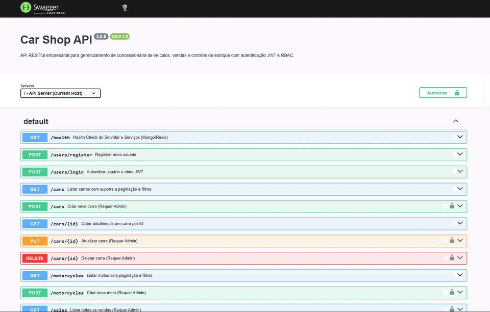
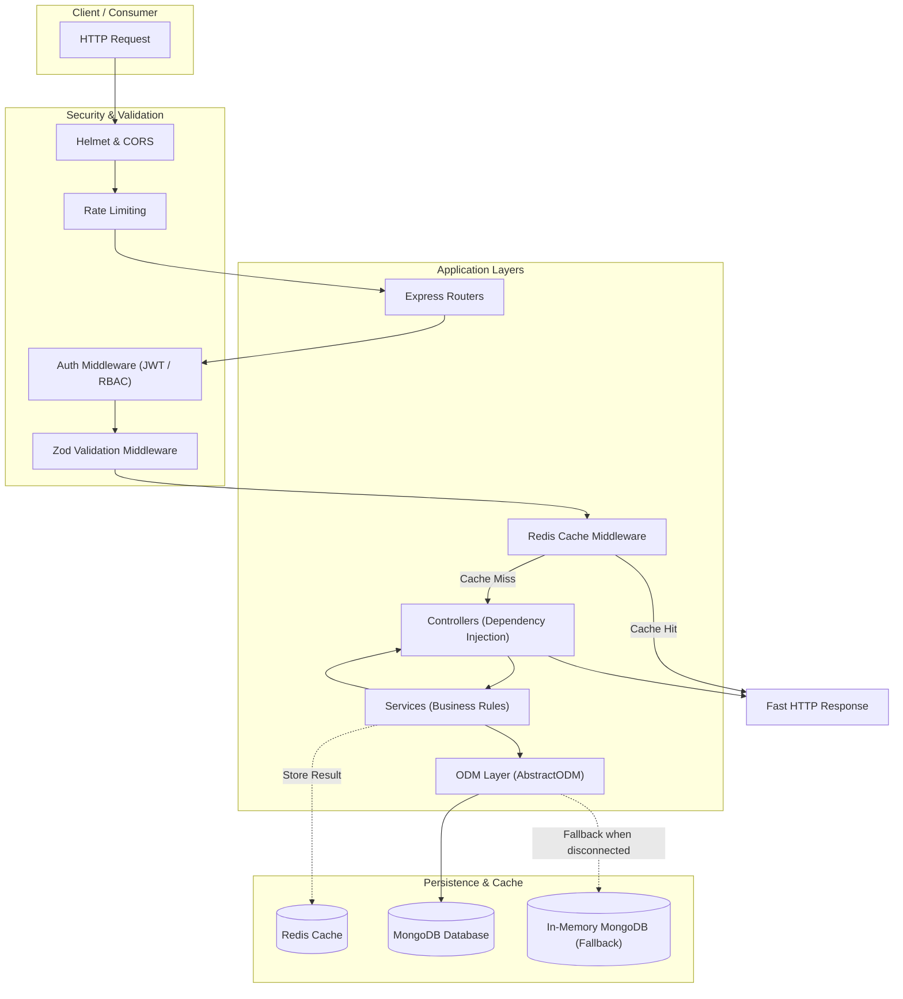

# 🚗 Car Shop API

[](https://www.typescriptlang.org/)
[](https://nodejs.org/)
[](https://expressjs.com/)
[](https://www.mongodb.com/)
[](https://redis.io/)
[](https://www.docker.com/)
[](https://swagger.io/)
[](https://vitest.dev/)
[](https://opensource.org/licenses/MIT)

> [**Português**](README.md) 🇧🇷 | 🇺🇸 **English Version**

High-performance corporate RESTful API for vehicle dealership management, sales, and inventory tracking, built with TypeScript applying Object-Oriented Programming (OOP) principles, Model-Service-Controller (MSC) layered architecture, ODM pattern with Mongoose, Zod schema validations, JWT authentication with RBAC, Redis in-memory caching, and resilient in-memory MongoDB fallback.

## 📌 Quick Navigation

- [📝 About the Project](#-about-the-project)
- [🖼️ Preview](#️-preview)
- [🌐 Online Swagger Demonstration](#-online-swagger-demonstration)
- [⚡ API Endpoints](#-api-endpoints)
- [✨ Key Features](#-key-features)
- [🛠️ Technologies and Tools](#️-technologies-and-tools)
- [🏛️ Solution Architecture](#️-solution-architecture)
- [📁 Repository Structure](#-repository-structure)
- [💡 Technical Decisions](#-technical-decisions)
- [🚀 Getting Started](#-getting-started)
- [📄 License](#-license)

## 📝 About the Project

The **Car Shop API** is a modern and robust backend solution designed to manage an entire dealership vehicle catalog (cars and motorcycles), sales transactions, and user access control.

The application was crafted following strict software engineering principles:
- **Abstraction and Polymorphism**: Clean domain model hierarchy where vehicles inherit core attributes from an `abstract class Vehicle`, eliminating duplicate code and ensuring straightforward extensibility for upcoming vehicle categories (e.g., trucks, boats).
- **Enterprise Security**: Stateless authentication via JSON Web Tokens (JWT), irreversible password hashing (bcrypt), Role-Based Access Control (RBAC - `admin` and `user`), DDoS and brute-force mitigation through rate limiting, and HTTP security headers with Helmet.
- **Resilience and Zero External Cloud Requirement**: Primary connection configurable with MongoDB and transparent automatic fallback to `mongodb-memory-server` in testing or showcase deployments, accompanied by Redis caching with an offline-tolerant fallback mode.

## 🖼️ Preview



## 🌐 Online Swagger Demonstration

Access the production deployment and explore endpoints interactively:
👉 **[Car Shop API Swagger](https://project-car-shop.onrender.com/docs/)**

> 💡 *Note: The root path `/` automatically redirects to the interactive documentation at `/docs`.*

## ⚡ API Endpoints

### 🔐 Authentication & Users (`/users`)
| Method | Endpoint | Access | Description |
| :--- | :--- | :--- | :--- |
| `POST` | `/users/register` | Public | Register new customer accounts (`role: user`) |
| `POST` | `/users/login` | Public | Authenticate with email/password to retrieve JWT token |

### 🚗 Cars (`/cars`)
| Method | Endpoint | Access | Description |
| :--- | :--- | :--- | :--- |
| `POST` | `/cars` | Authenticated | Create a new car record with Zod validation |
| `GET` | `/cars` | Public | List cars with pagination (`page`, `limit`), filters, and Redis cache |
| `GET` | `/cars/:id` | Public | Retrieve a specific car by its `ObjectId` |
| `PUT` | `/cars/:id` | Authenticated | Update all attributes of an existing car |
| `DELETE` | `/cars/:id` | Admin | Delete a car from the inventory |

### 🏍️ Motorcycles (`/motorcycles`)
| Method | Endpoint | Access | Description |
| :--- | :--- | :--- | :--- |
| `POST` | `/motorcycles` | Authenticated | Create a motorcycle record with displacement validation |
| `GET` | `/motorcycles` | Public | List motorcycles with dynamic query filters and cache |
| `GET` | `/motorcycles/:id` | Public | Retrieve a motorcycle by its `ObjectId` |
| `PUT` | `/motorcycles/:id` | Authenticated | Update an existing motorcycle record |
| `DELETE` | `/motorcycles/:id` | Admin | Delete a motorcycle from the inventory |

### 💼 Sales & Inventory (`/sales`)
| Method | Endpoint | Access | Description |
| :--- | :--- | :--- | :--- |
| `POST` | `/sales` | Authenticated | Record a sale transaction, mark vehicle as unavailable (`status: false`), and invalidate cache |
| `GET` | `/sales` | Admin | List all completed sales records |
| `GET` | `/sales/:id` | Admin / Creator | Retrieve detailed sale information by `ObjectId` |

### 🩺 Monitoring & Documentation
| Method | Endpoint | Access | Description |
| :--- | :--- | :--- | :--- |
| `GET` | `/health` | Public | Health check reporting service status and `uptime` |
| `GET` | `/docs` | Public | Interactive Swagger UI / OpenAPI 3.0 documentation |
| `GET` | `/` | Public | Automatic redirect to `/docs` |

## ✨ Key Features

- **Full Vehicle CRUD**: Strict typing, data validation, and complete lifecycle management for cars and motorcycles.
- **Pagination and Dynamic Filters**: Support for query parameters including `model`, `color`, `year`, `minPrice`, `maxPrice`, `page`, and `limit`.
- **Fail-Fast Validation with Zod**: Rejects malformed payloads with descriptive HTTP `400` errors before execution reaches business logic layers.
- **JWT & Role-Based Access Control (RBAC)**: Fine-grained permissions using `roleMiddleware('admin')`, ensuring sensitive actions like deletion and sales reporting are restricted to administrators.
- **Transactional Sales with Inventory Depletion**: Atomic checkout flow that validates vehicle availability and marks it sold.
- **Redis Caching Strategy**: Significantly reduces database load and latency for `GET` requests, featuring automated cache purging upon `POST`, `PUT`, or `DELETE` events.
- **Centralized Exception Handling**: Unifies error formatting across validation errors, operational client errors (`400`, `401`, `403`, `404`), and unhandled server exceptions (`500`).
- **Resilient Database Fallback**: Automatically bootstraps an embedded in-memory MongoDB instance when external database credentials are not supplied.

## 🛠️ Technologies and Tools

| Layer / Purpose | Technology | Description |
| :--- | :--- | :--- |
| **Core Language** | **TypeScript 4.9.5** | Static typing, generic interfaces, and OOP abstractions |
| **Runtime Environment** | **Node.js 20.x** | Modern, performant JavaScript runtime with LTS stability |
| **Web Framework** | **Express 4.17.1** | Modular routing, middleware pipeline, and HTTP handling |
| **Database & ODM** | **MongoDB & Mongoose 6.1.8** | Flexible NoSQL document database with reusable `AbstractODM<T>` |
| **In-Memory Database (Fallback)** | **mongodb-memory-server 11.2.0** | Embedded zero-configuration MongoDB server for seamless demos |
| **Cache Layer** | **Redis & ioredis 6.0.0** | Ultra-fast caching with silent offline resilience |
| **Schema Validation** | **Zod 3.22.4** | Declarative schema validation with TypeScript type inference |
| **Authentication & Security** | **JWT & bcryptjs & Helmet** | Cryptographic tokens, salt-hashed passwords, and secure HTTP headers |
| **Interactive Documentation** | **Swagger UI & OpenAPI 3.0** | Interactive web console to test API endpoints in real time |
| **Automated Testing** | **Vitest 1.6.0 & Supertest** | High-speed concurrent unit and integration test runner |
| **Containerization** | **Docker & Docker Compose** | Multi-platform production image built on Debian Slim (`node:20-slim`) |

## 🏛️ Solution Architecture

The solution implements a clean **Model-Service-Controller (MSC)** architecture enriched with generic **Object Document Mapper (ODM)** abstractions.



## 📁 Repository Structure

```text
project-car-shop/
├── .github/                  # CI/CD and automation workflows
├── images/                   # Media and presentation assets
│   └── projeto.gif           # Animated walkthrough of the application
├── src/
│   ├── Controllers/          # Controllers (HTTP handling and responses)
│   │   ├── CarController.ts
│   │   ├── MotorcycleController.ts
│   │   ├── SaleController.ts
│   │   └── UserController.ts
│   ├── Domains/              # Rich Domain Entities (OOP)
│   │   ├── Vehicle.ts        # Base abstract class
│   │   ├── Car.ts            # Specialized domain entity
│   │   └── Motorcycle.ts     # Specialized domain entity
│   ├── Interfaces/           # TypeScript contracts and types
│   │   ├── ICar.ts
│   │   ├── IMotorcycle.ts
│   │   ├── ISale.ts
│   │   ├── IUser.ts
│   │   └── IVehicle.ts
│   ├── Middlewares/          # Route and global middlewares
│   │   ├── authMiddleware.ts # JWT verification and RBAC authorization
│   │   ├── cacheMiddleware.ts# Redis cache interceptor and provider
│   │   ├── ErrorHandler.ts   # Centralized global exception handler
│   │   └── validationMiddleware.ts # Schema-driven generic Zod validator
│   ├── Models/               # ODM layer and database connection
│   │   ├── AbstractODM.ts    # Generic abstract class for Mongoose models
│   │   ├── CarODM.ts
│   │   ├── MotorcycleODM.ts
│   │   ├── SaleODM.ts
│   │   ├── UserODM.ts
│   │   └── Connection.ts     # Connection manager with in-memory fallback
│   ├── Routes/               # Express route declarations
│   │   ├── CarRoute.ts
│   │   ├── MotorcycleRoute.ts
│   │   ├── SaleRoute.ts
│   │   ├── UserRoute.ts
│   │   └── HealthRoute.ts
│   ├── Services/             # Business logic layer
│   │   ├── CarService.ts
│   │   ├── MotorcycleService.ts
│   │   ├── SaleService.ts
│   │   └── UserService.ts
│   ├── Validations/          # Declarative Zod validation schemas
│   │   ├── vehicleValidation.ts
│   │   └── userValidation.ts
│   ├── docs/                 # API documentation
│   │   └── swagger.json      # OpenAPI 3.0 specification
│   ├── utils/                # Infrastructure clients and helpers
│   │   ├── filterHelpers.ts  # Dynamic query filter builder
│   │   └── redisClient.ts    # Redis client connection and offline fallback
│   ├── app.ts                # Express app configuration and middlewares
│   └── server.ts             # Application entrypoint and database boot
├── tests/                    # Automated testing suite
│   ├── integration/          # Route integration and security tests
│   └── unit/                 # Unit tests with mocks and service assertions
├── Dockerfile                # Production container image (Debian Slim)
├── docker-compose.yml        # Local orchestration for MongoDB and Redis
├── package.json              # Dependencies and npm scripts
├── tsconfig.json             # TypeScript compiler settings
└── vitest.config.ts          # Vitest testing configuration
```

## 💡 Technical Decisions

- **Generic Abstraction with `AbstractODM<T>`**: Instead of calling Mongoose models directly within service layers, an abstract base class standardizes `create`, `find`, `findById`, `update`, `delete`, and `getPaginated`, keeping business logic cleanly decoupled from persistence details.
- **Domain Modeling with `abstract class Vehicle`**: Common vehicle attributes (`id`, `model`, `year`, `color`, `buyValue`, `status`) reside in the abstract base entity `Vehicle`, enforcing strict domain specialization (`doorsQty` and `seatsQty` for `Car`; `category` and `engineCapacity` for `Motorcycle`).
- **Zod Schema Validation & Fail-Fast**: Validating payloads upfront ensures corrupted or invalid data never reaches services or the database. Clear, structured error messages are returned with HTTP `400`.
- **Intelligent Cache with Automatic Invalidation**: Query endpoints leverage Redis caching using dynamically computed hash keys. Any write mutation (`POST`, `PUT`, `DELETE`, or sale completion) automatically invalidates relevant cache patterns to prevent stale data.
- **Test Suite Modernization with Vitest**: Replaced legacy Mocha/Chai/Sinon with **Vitest**, providing instant startup, native TypeScript execution, and fast concurrent execution.
- **Autonomous In-Memory Fallback for Demos**: `Connection.ts` attempts to connect to `MONGO_URI` and, if unreachable or undefined, gracefully spins up an embedded `mongodb-memory-server`, allowing instant evaluation on PaaS hosting without provisioned external databases.

## 🚀 Getting Started

### Prerequisites
- [Node.js](https://nodejs.org/) version `20.x` or higher
- [npm](https://www.npmjs.com/) or [yarn](https://yarnpkg.com/)
- [Docker](https://www.docker.com/) and [Docker Compose](https://docs.docker.com/compose/) (optional, recommended for complete local environment)

### 1. Clone the Repository
```bash
git clone https://github.com/ludson96/project-car-shop.git
cd project-car-shop
```

### 2. Install Dependencies
```bash
npm install
```

### 3. Environment Variables Configuration
Create a `.env` file in the project root following `.env.example`:
```bash
cp .env.example .env
```

Example configuration:
```env
PORT=3001
MONGO_URI=mongodb://localhost:27017/CarShop
JWT_SECRET=your_super_secret_jwt_key
REDIS_URL=redis://localhost:6379
```

> ℹ️ *If no `MONGO_URI` is supplied or MongoDB is offline, the application will automatically initialize an embedded in-memory MongoDB instance.*

### 4. Run with Docker Compose (Recommended)
To start the application alongside local MongoDB and Redis instances:
```bash
docker-compose up -d --build
```
The API will be available at `http://localhost:3001`.

### 5. Run in Local Development Mode
```bash
npm run dev
```

### 6. Run the Test Suite
To run all unit and integration tests with Vitest:
```bash
npm test
```

To run tests with code coverage reporting:
```bash
npm run test:coverage
```

### 7. Code Quality Check (Lint)
```bash
npm run lint
```

## 📄 License

This project is licensed under the [MIT License](https://opensource.org/licenses/MIT).

<div align="center">
  Developed by <strong>Ludson Pereira dos Santos</strong> 🚀<br />
  <a href="https://www.linkedin.com/in/ludson96/">LinkedIn</a> • <a href="https://github.com/ludson96">GitHub</a> • <a href="mailto:ludson_ps27@hotmail.com">E-mail</a>
</div>
