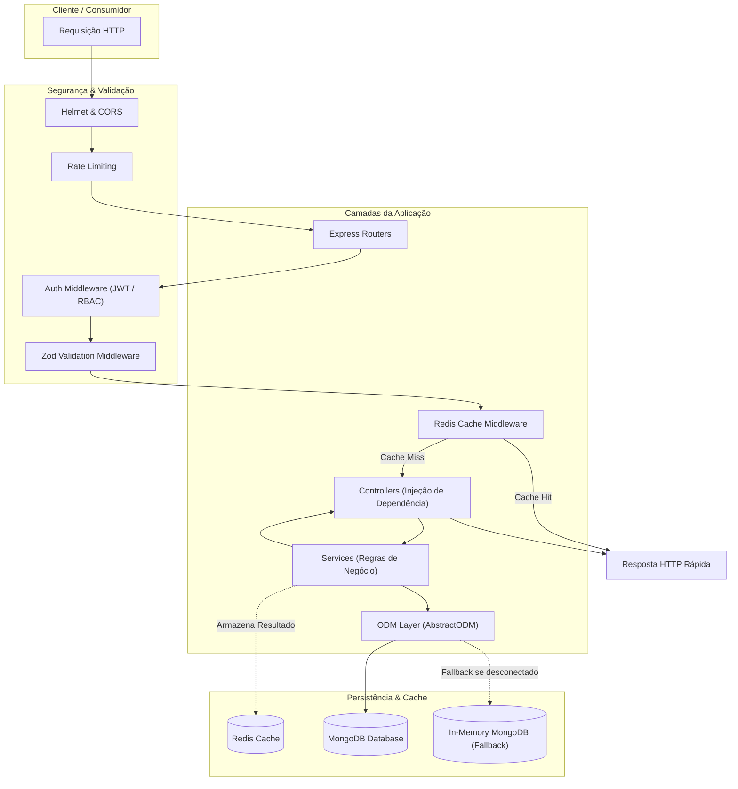

# 🚗 Car Shop API

[](https://www.typescriptlang.org/)
[](https://nodejs.org/)
[](https://expressjs.com/)
[](https://www.mongodb.com/)
[](https://redis.io/)
[](https://www.docker.com/)
[](https://swagger.io/)
[](https://vitest.dev/)
[](https://opensource.org/licenses/MIT)

> 🇧🇷 **Português** | 🇺🇸 [**English Version**](README.en.md)

API RESTful corporativa de alta performance para gestão de concessionária de veículos, vendas e controle de estoque, desenvolvida com TypeScript sob os princípios da Programação Orientada a Objetos (POO), arquitetura em camadas MSC (Model-Service-Controller), padrão ODM com Mongoose, validações com Zod, autenticação JWT com RBAC, cache em memória com Redis e fallback autônomo com MongoDB em memória.

## 📌 Navegação Rápida

- [📝 Sobre o Projeto](#-sobre-o-projeto)
- [🖼️ Preview](#️-preview)
- [🌐 Demonstração Online do Swagger](#-demonstração-online-do-swagger)
- [⚡ API Endpoints](#-api-endpoints)
- [✨ Funcionalidades](#-funcionalidades)
- [🛠️ Tecnologias e Ferramentas Utilizadas](#️-tecnologias-e-ferramentas-utilizadas)
- [🏛️ Arquitetura da Solução](#️-arquitetura-da-solução)
- [📁 Estrutura do Repositório](#-estrutura-do-repositório)
- [💡 Decisões Técnicas](#-decisões-técnicas)
- [🚀 Como Executar o Projeto](#-como-executar-o-projeto)
- [📄 Licença](#-licença)

## 📝 Sobre o Projeto

O **Car Shop API** é uma solução de backend moderna e robusta projetada para gerenciar o catálogo completo de veículos (carros e motocicletas), movimentações comerciais e controle de usuários de uma concessionária.

A aplicação foi estruturada seguindo rígidos padrões de engenharia de software:
- **Abstração e Polimorfismo**: Hierarquia de domínio limpa onde veículos herdam propriedades fundamentais de uma classe abstrata `Vehicle`, evitando duplicidade de código e garantindo extensibilidade para novas categorias (ex.: caminhões, barcos).
- **Segurança Empresarial**: Autenticação stateless via JSON Web Tokens (JWT), senhas com hashing irreversível (bcrypt), controle de acesso baseado em papéis (RBAC - `admin` e `user`), além de proteção contra ataques DDoS/brute-force com rate limiting e headers de segurança com Helmet.
- **Resiliência e Zero Dependência Externa no Deploy**: Conexão primária configurável com MongoDB e fallback automático transparente para `mongodb-memory-server` em ambientes de demonstração ou testes, além de cache em Redis com modo offline resiliente (não derruba a aplicação caso o Redis esteja indisponível).

## 🖼️ Preview


## 🌐 Demonstração Online do Swagger

Acesse a aplicação em produção e teste os endpoints interativamente:
👉 **[Car Shop API Swagger](https://project-car-shop.onrender.com/docs/)**

> 💡 *Nota: A rota raiz `/` da aplicação redireciona automaticamente para a documentação interativa `/docs`.*

## ⚡ API Endpoints

### 🔐 Autenticação & Usuários (`/users`)
| Método | Endpoint | Acesso | Descrição |
| :--- | :--- | :--- | :--- |
| `POST` | `/users/register` | Público | Cadastro de novos clientes (`role: user`) |
| `POST` | `/users/login` | Público | Autenticação com e-mail/senha gerando token JWT |

### 🚗 Carros (`/cars`)
| Método | Endpoint | Acesso | Descrição |
| :--- | :--- | :--- | :--- |
| `POST` | `/cars` | Autenticado | Cadastro de novo carro com validação Zod |
| `GET` | `/cars` | Público | Listagem com paginação (`page`, `limit`), filtros e cache Redis |
| `GET` | `/cars/:id` | Público | Busca de carro específico por `ObjectId` |
| `PUT` | `/cars/:id` | Autenticado | Atualização completa de dados do carro |
| `DELETE` | `/cars/:id` | Admin | Remoção de carro do catálogo |

### 🏍️ Motocicletas (`/motorcycles`)
| Método | Endpoint | Acesso | Descrição |
| :--- | :--- | :--- | :--- |
| `POST` | `/motorcycles` | Autenticado | Cadastro de motocicleta com validação de cilindradas |
| `GET` | `/motorcycles` | Público | Listagem paginada com filtros dinâmicos e cache |
| `GET` | `/motorcycles/:id` | Público | Busca de motocicleta por `ObjectId` |
| `PUT` | `/motorcycles/:id` | Autenticado | Atualização de dados da motocicleta |
| `DELETE` | `/motorcycles/:id` | Admin | Remoção de motocicleta do catálogo |

### 💼 Vendas & Estoque (`/sales`)
| Método | Endpoint | Acesso | Descrição |
| :--- | :--- | :--- | :--- |
| `POST` | `/sales` | Autenticado | Registra venda, atualiza status do veículo (`status: false`) e invalida cache |
| `GET` | `/sales` | Admin | Relatório de todas as vendas realizadas |
| `GET` | `/sales/:id` | Admin / Autor | Detalhes de venda por `ObjectId` |

### 🩺 Monitoramento & Docs
| Método | Endpoint | Acesso | Descrição |
| :--- | :--- | :--- | :--- |
| `GET` | `/health` | Público | Health check de status da API e tempo de atividade (`uptime`) |
| `GET` | `/docs` | Público | Documentação interativa Swagger UI / OpenAPI 3.0 |
| `GET` | `/` | Público | Redirecionamento automático para `/docs` |

## ✨ Funcionalidades

- **CRUD Completo de Veículos**: Cadastro, busca, atualização e exclusão com consistência de tipos e validação estrita.
- **Paginação e Filtros Dinâmicos**: Suporte a paginação eficiente com parâmetros de consulta como `model`, `color`, `year`, `minPrice`, `maxPrice`, `page` e `limit`.
- **Validação Fail-Fast com Zod**: Esquemas que validam formato de dados, anos válidos, valores monetários e campos obrigatórios antes que a requisição atinja as camadas de serviço.
- **Autenticação JWT e RBAC**: Proteção granular por privilégios com o middleware `roleMiddleware('admin')`, permitindo que ações críticas de exclusão e relatórios de vendas sejam restritas a administradores.
- **Transação de Vendas e Baixa de Estoque**: Criação de pedidos com verificação de disponibilidade do veículo e alteração atômica do status para indisponível.
- **Estratégia de Cache com Redis**: Redução substancial de latência e consumo de banco de dados em endpoints de listagem `GET`, com invalidação inteligente de cache após operações de escrita (`POST`, `PUT`, `DELETE`).
- **Tratamento Centralizado de Exceções**: Middleware unificado capturando erros de validação Zod, erros operacionais (`400`, `401`, `403`, `404`) e erros internos não previstos (`500`).
- **Resiliência de Banco de Dados**: Inicialização autônoma de MongoDB em memória caso não haja uma instância de banco configurada via variável de ambiente.

## 🛠️ Tecnologias e Ferramentas Utilizadas

| Camada / Finalidade | Tecnologia | Descrição |
| :--- | :--- | :--- |
| **Linguagem Principal** | **TypeScript 4.9.5** | Tipagem estática rigorosa, interfaces genéricas e abstrações POO |
| **Ambiente de Execução** | **Node.js 20.x** | Runtime JavaScript moderno, performático e com suporte de longo prazo |
| **Framework Web** | **Express 4.17.1** | Roteamento modular, middlewares reutilizáveis e manipulação HTTP |
| **Banco de Dados & ODM** | **MongoDB & Mongoose 6.1.8** | Banco NoSQL flexível com abstração genérica em `AbstractODM<T>` |
| **Banco In-Memory (Fallback)** | **mongodb-memory-server 11.2.0** | Servidor MongoDB embutido para execução portátil e sem infraestrutura prévia |
| **Cache em Memória** | **Redis & ioredis 6.0.0** | Cache de alta velocidade com fallback silencioso para operações offline |
| **Validação de Dados** | **Zod 3.22.4** | Validação declarativa de esquemas com inferência de tipos TypeScript |
| **Autenticação & Segurança** | **JWT & bcryptjs & Helmet** | Tokens de acesso assinados, hash criptográfico de senhas e proteção de cabeçalhos |
| **Documentação Interativa** | **Swagger UI & OpenAPI 3.0** | Interface web interativa para exploração e testes diretos de endpoints |
| **Testes Automatizados** | **Vitest 1.6.0 & Supertest** | Suíte de testes unitários e de integração com alta velocidade de execução |
| **Containerização** | **Docker & Docker Compose** | Imagem de produção baseada em Debian Slim (`node:20-slim`) |

## 🏛️ Arquitetura da Solução

O projeto adota uma arquitetura limpa em camadas (**Model-Service-Controller**), complementada pelo padrão **ODM (Object Document Mapper)** com abstrações genéricas.



## 📁 Estrutura do Repositório

```text
project-car-shop/
├── .github/                  # Fluxos de automação e workflows
├── images/                   # Imagens e mídias de demonstração
│   └── projeto.gif           # Demonstração visual animada da aplicação
├── src/
│   ├── Controllers/          # Camada de controle (recebimento HTTP e resposta)
│   │   ├── CarController.ts
│   │   ├── MotorcycleController.ts
│   │   ├── SaleController.ts
│   │   └── UserController.ts
│   ├── Domains/              # Entidades ricas de domínio (POO)
│   │   ├── Vehicle.ts        # Classe abstrata base
│   │   ├── Car.ts            # Entidade de domínio especializada
│   │   └── Motorcycle.ts     # Entidade de domínio especializada
│   ├── Interfaces/           # Contratos e tipos TypeScript
│   │   ├── ICar.ts
│   │   ├── IMotorcycle.ts
│   │   ├── ISale.ts
│   │   ├── IUser.ts
│   │   └── IVehicle.ts
│   ├── Middlewares/          # Middlewares globais e de rota
│   │   ├── authMiddleware.ts # Verificação de token JWT e autorização RBAC
│   │   ├── cacheMiddleware.ts# Interceptador e provedor de cache Redis
│   │   ├── ErrorHandler.ts   # Tratamento global centralizado de erros
│   │   └── validationMiddleware.ts # Validação genérica orientada a esquemas Zod
│   ├── Models/               # Camada ODM e conexão de dados
│   │   ├── AbstractODM.ts    # Classe genérica abstrata para modelos Mongoose
│   │   ├── CarODM.ts
│   │   ├── MotorcycleODM.ts
│   │   ├── SaleODM.ts
│   │   ├── UserODM.ts
│   │   └── Connection.ts     # Gerenciamento de conexão com fallback em memória
│   ├── Routes/               # Declaração e mapeamento de rotas Express
│   │   ├── CarRoute.ts
│   │   ├── MotorcycleRoute.ts
│   │   ├── SaleRoute.ts
│   │   ├── UserRoute.ts
│   │   └── HealthRoute.ts
│   ├── Services/             # Regras de negócio da aplicação
│   │   ├── CarService.ts
│   │   ├── MotorcycleService.ts
│   │   ├── SaleService.ts
│   │   └── UserService.ts
│   ├── Validations/          # Esquemas de validação declarativa Zod
│   │   ├── vehicleValidation.ts
│   │   └── userValidation.ts
│   ├── docs/                 # Documentação da API
│   │   └── swagger.json      # Especificação OpenAPI 3.0
│   ├── utils/                # Utilitários, clientes de infraestrutura e helpers
│   │   ├── filterHelpers.ts  # Montagem de filtros dinâmicos de busca
│   │   └── redisClient.ts    # Instância de conexão e fallback do Redis
│   ├── app.ts                # Inicialização, middlewares globais e rotas Express
│   └── server.ts             # Ponto de entrada e conexão com banco de dados
├── tests/                    # Suíte completa de testes automatizados
│   ├── integration/          # Testes de integração de rotas e segurança
│   └── unit/                 # Testes unitários com mocks e asserções de serviço
├── Dockerfile                # Imagem de produção containerizada (Debian Slim)
├── docker-compose.yml        # Orquestração local de MongoDB e Redis
├── package.json              # Dependências e scripts npm
├── tsconfig.json             # Configurações do compilador TypeScript
└── vitest.config.ts          # Configuração da suíte de testes com Vitest
```

## 💡 Decisões Técnicas

- **Abstração com `AbstractODM<T>`**: Em vez de invocar modelos Mongoose diretamente nos serviços, foi criada uma camada base que padroniza operações como `create`, `find`, `findById`, `update`, `delete` e `getPaginated`, mantendo a camada de serviço desacoplada de detalhes do banco de dados.
- **Herança e Modelagem em Domínio com `abstract class Vehicle`**: Atributos fundamentais (`id`, `model`, `year`, `color`, `buyValue`, `status`) residem na entidade abstrata base `Vehicle`, forçando especializações conscientes (`doorsQty` e `seatsQty` para `Car`, `category` e `engineCapacity` para `Motorcycle`).
- **Validação com Zod e Fail-Fast**: Validar antes do fluxo de negócio garante que nenhum payload inconsistente chegue aos serviços ou persista estados corrompidos no banco de dados. Mensagens descritivas são entregues em formato padronizado com código HTTP `400`.
- **Cache Transparente com Invalidação Automatizada**: Endpoints de listagem utilizam o Redis com chaves geradas dinamicamente com base nos filtros aplicados. Ao cadastrar, alterar ou excluir um veículo ou registrar uma venda, o cache correspondente é invalidado para evitar dados desatualizados (*stale data*).
- **Substituição da Suíte de Testes por Vitest**: A migração de Mocha/Chai/Sinon para o **Vitest** eliminou dependências legadas, aumentou a velocidade de execução com execução concorrente nativa em TypeScript e viabilizou relatórios de cobertura diretos sem overhead.
- **Deploy Autónomo com Fallback In-Memory**: O `Connection.ts` foi projetado para tentar conexão com a URI do MongoDB informada e, caso indisponível, inicializar automaticamente o `mongodb-memory-server`, permitindo a execução imediata em plataformas como o Render sem exigir a contratação de clusters gerenciados externos.

## 🚀 Como Executar o Projeto

### Pré-requisitos
- [Node.js](https://nodejs.org/) versão `20.x` ou superior
- [npm](https://www.npmjs.com/) ou [yarn](https://yarnpkg.com/)
- [Docker](https://www.docker.com/) e [Docker Compose](https://docs.docker.com/compose/) (opcional, recomendado para ambiente completo)

### 1. Clonar o Repositório
```bash
git clone https://github.com/ludson96/project-car-shop.git
cd project-car-shop
```

### 2. Instalar as Dependências
```bash
npm install
```

### 3. Configurar Variáveis de Ambiente
Crie um arquivo `.env` na raiz do projeto com base no modelo `.env.example`:
```bash
cp .env.example .env
```

Exemplo de configuração:
```env
PORT=3001
MONGO_URI=mongodb://localhost:27017/CarShop
JWT_SECRET=seu_jwt_secret_super_seguro
REDIS_URL=redis://localhost:6379
```

> ℹ️ *Caso nenhuma variável `MONGO_URI` seja definida ou o MongoDB não esteja acessível, a aplicação utilizará automaticamente o MongoDB em memória.*

### 4. Execução com Docker Compose (Recomendado)
Para subir a aplicação em conjunto com instâncias locais do MongoDB e Redis:
```bash
docker-compose up -d --build
```
A API estará pronta e acessível em `http://localhost:3001`.

### 5. Execução em Modo de Desenvolvimento Local
```bash
npm run dev
```

### 6. Execução da Suíte de Testes
Para rodar todos os testes unitários e de integração com o Vitest:
```bash
npm test
```

Para rodar os testes e gerar relatório de cobertura de código:
```bash
npm run test:coverage
```

### 7. Verificação de Qualidade de Código (Lint)
```bash
npm run lint
```

## 📄 Licença

Este projeto está licenciado sob a licença [MIT](https://opensource.org/licenses/MIT).

<div align="center">
  Desenvolvido por <strong>Ludson Pereira dos Santos</strong> 🚀<br />
  <a href="https://www.linkedin.com/in/ludson96/">LinkedIn</a> • <a href="https://github.com/ludson96">GitHub</a> • <a href="mailto:ludson_ps27@hotmail.com">E-mail</a>
</div>
